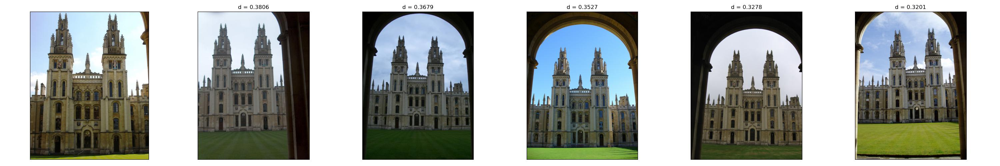
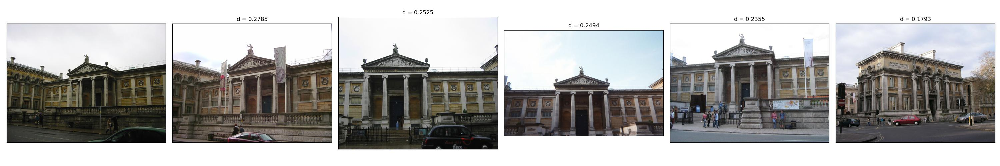
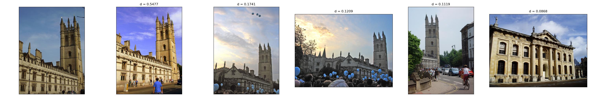
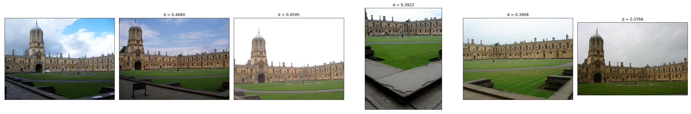
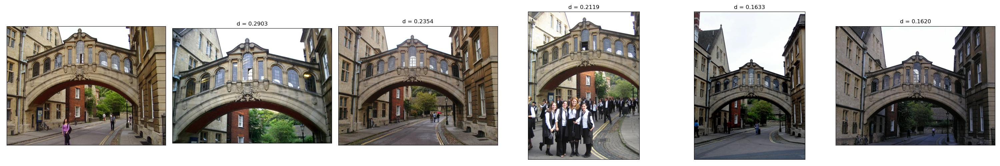
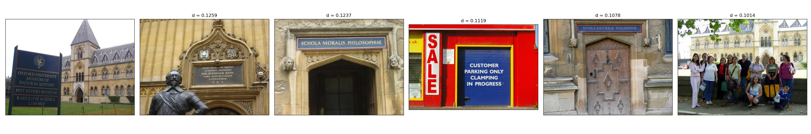
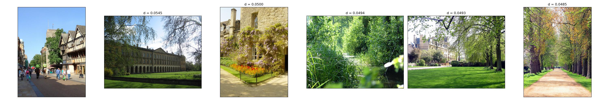
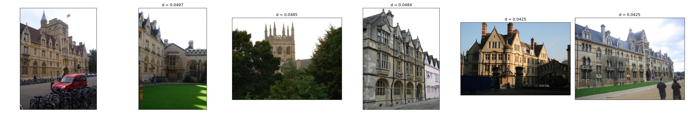

# Bag-of-visual-word Model

## Info

|Name|Student ID|Mail|
|---|---|---|
|Vũ Lê Thế Anh|20C13002|anh.vu2020@ict.jvn.edu.vn|

## Requirements

Install `opencv` by

```
conda install -c menpo opencv
```

Install `faiss` by

```
conda install -c pytorch faiss-gpu
```

Install the other libraries

```
conda install tqdm matplotlib scipy
```

## How to run

### **Step 1: Prepare the data**

#### **Step 1.1: Download the dataset**

```
sh download_data.sh
```

This will download and extract the data to the `data` folder, creating two new subfolders:

- `oxbuild_images`: containing all the images;
- `gt_files_170407`: containing some groundtruth metadata (of interest are the `*_query` files).

#### **Step 1.2: Preprocess the data**

```
python preprocess.py
```

This will create two lists:

- `data/query.txt`: containing the filenames of the images serving as queries, as well as the coordinates defining the bounding box indicating the area of interest for each image;
- `data/gallery.txt`: containing the filenames of the images serving to create the codebook.

### **Step 2: Extract descriptors from the images**

```
python extract.py
```

This will create two files:

- `output/descriptors.npy`: NumPy array containing all descriptors extracted from all images in the training list
- `output/metadata.csv`: telling the order and the number of descriptors extracted from the images

### **Step 3: Cluster the descriptors pool**

```
python cluster.py
```

This will train a K-Means Clustering model using `faiss` and save the centroids to `output/kmeans.npy` for future assignments of cluster ID.

### **Step 4: Find the set of cluster IDs for each image**

```
python assign_clusterid.py
```

This will assign cluster IDs to each descriptor of each image in the gallery.

### **Step 5: Calculate the TF-IDF**

```
python tfidf.py
```

This will calculate the TF-IDF of the gallery images and produce 2 files:

- `output/tfidf.npz`: a SciPy sparse matrix to store the TF-IDF vector of the gallery images
- `output/idf.npy`: the IDF values of each term

### **Step 6: Query**

```
python query.py <path/to/query/image> <number of results>
```

This will perform the query and return the most similar images in the gallery.

```
python batch_query.py
```

This will perform all the queries in `data/query.txt` and store the result in `result`.

## **Result**

### **Good**











### **Bad**







### **Comments**

- Most good results have high similarity with the query image. On the other hand, most bad results have low similarity.
- A possible reason for bad results is that there are too many noise descriptors (descriptors of surrounding objects different from the object of interest).
